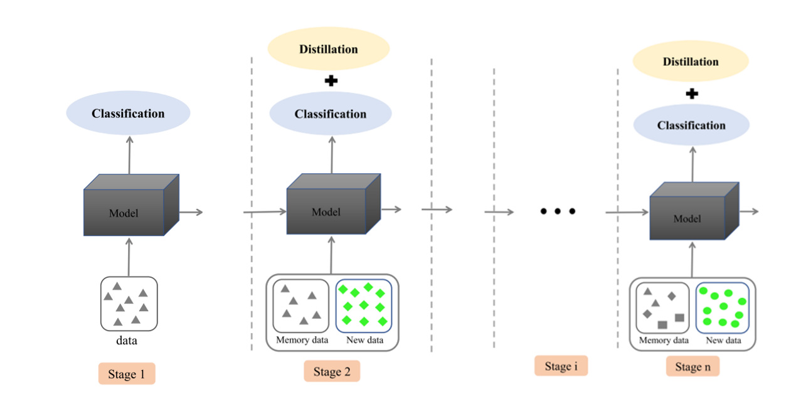
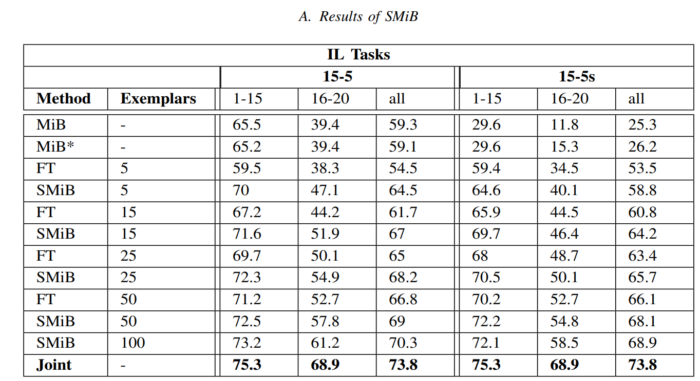
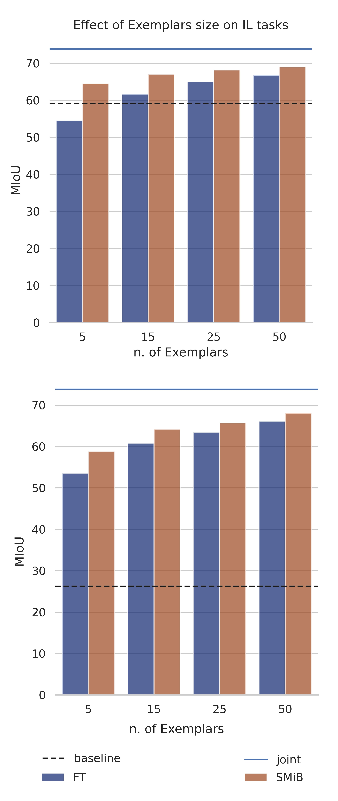

# Incremental Learning in Semantic Segmentation using Exemplars

This is the official PyTorch implementation of our project for Machine Learning and Deep Learning [course](https://didattica.polito.it/pls/portal30/gap.pkg_guide.viewGap?p_cod_ins=01TXFSM&p_a_acc=2021&p_header=S&p_lang=EN&multi=Nhttps://).

We study the behaviour of semantic segmentation models in incremental learning setup.
We introduce a new incremental learning technique which merges rehearsal and data regularization techniques to overcome catastrophic forgetting and task-recency bias.

we first perform a segmentation task on the Pascal VOC dataset using [BiSeNet](https://arxiv.org/abs/1808.00897) , a lightweight model for real time semantic segmentation. Afterwards, we modify our model to adopt an incremental learning protocol MiB.

## MiB (CVPR 2020)

In this [paper](https://arxiv.org/abs/2002.00718), authors present a novel approach and they define a new evaluation benchmark for incremental learning in semantic segmentation.
They asses the performance of their method and previous state-of-the-art methods on Pascal-VOC 2012 and ADE20K datasets.

## Soft MiB

As an extension, we study the role of exemplars in incremental learning.
We modify the MiB protocol and allow a fixed number of exemplars per class to be stored and used in future training sessions. Our proposed method (SMiB) provides prominent results even when a small number of exemplars are used.

Incremental setup using SMiB protocol:

# Results and Conclusions

Results are shown using The mean intersection over union (mIoU) score as evaluation metric.

<figure>
  
  <figcaption>Exemplars effect on models performance for 15-5 (top) and 15-5s (bottom) tasks.</figcaption>
</figure>
 

Exemplars effect on models performance for 15-5 (top) and 15-5s (bottom) tasks.

Rehearsal based methods outperform other non-rehearsal techniques even when stored samples are very few.
Pixel-level annotations in semantic segmentation helps the model to retain the previous knowledge using very few exemplars.

# Requirements

This repository uses the following libraries:

- Python (3.6)
- Pytorch (1.2)
- torchvision (0.4.0)
- tensorboardX (1.8)
- matplotlib (3.3.1)
- numpy (1.17.2)

We also assume to have installed pytorch.distributed package.

To facilitate your work in installing all dependencies, we provide you the requirement (requirements.txt) file.

# How to download data

We test BiSeNet on the PASCAL Visual Object Classes (VOC) 2012 dataset which contains 20 object categories and one special category, the background. More than 12,000 images with pixel-level annotations are used to train the model.
We provide the script to download the dataset in 'data/download_voc.sh'.
The script takes no inputs but use it in the target directory (where you want to download data).

# How to perform training

The most important file is run.py, that is in charge to start the training or test procedure.
To run it, simpy use the following command:

> python -m torch.distributed.launch --nproc_per_node=\<num_GPUs\> run.py --data_root \<data_folder\> --name \<exp_name\> .. other args ..

The default is to use a pretraining for the backbone used, that is searched in the pretrained folder of the project.
We used the official ResNet50 as our pretrained model.

If you don't want to use pretrained, please use --no-pretrained.

There are many options (you can see them all by using --help option), but we arranged the code to being straightforward to test the reported methods.
Leaving all the default parameters, you can replicate the experiments by setting the following options.

- please specify the data folder using: --data_root \<data_root\>
- dataset: --dataset voc (Pascal-VOC 2012)
- task: --task \<task\>, where tasks are
  - 15-5, 15-5s, 19-1 (VOC)
- step (each step is run separately): --step \<N\>, where N is the step number, starting from 0
- disjoint is default setup, to enable overlapped: --overlapped
- learning rate: --lr 0.01 (for step 0) | 0.001 (for step > 0)
- batch size: --batch_size \<24/num_GPUs\>
- epochs: --epochs 30
- method: --method \<method name\>, where names are
  - FT, LWF, LWF-MC, ILT, EWC, RW, PI, MIB

For all details please follow the information provided using the help option.

#### Example commands

LWF on 15-5 disjoint setting of VOC, step 1:

> python run.py --data_root data --batch_size 12 --dataset voc --name LWF --task 15-5 --step 1 --lr 0.001 --epochs 30 --method LWF

MiB on 15-5s setting of VOC, step 1, using 5 Exemplars of each old class:

> python run.py --task '15-5s'  --step 1 --lr 0.001 --epochs 30 --method 'MiB' --batch_size 32 --use_exemplars --overlap --exemplars_size 5 --val_interval 1

Once you trained the model, you can see the result on tensorboard (we perform the test after the whole training)
or you can test it by using the same script and parameters but using the command

> --test

that will skip all the training procedure and test the model on test data.

# References

- Changqian Yu, Jingbo Wang, Chao Peng, Changxin Gao, Gang Yu, Nong Sang. BiSeNet: Bilateral Segmentation Network for Real-time Semantic
  Segmentation, 2018.
- Sylvestre-Alvise Rebuffi, Alexander Kolesnikov, Georg Sperl, Christoph H. Lampert. iCaRL: Incremental Classifier and Representation Learning
- Marc Masana, Xialei Liu, Bartlomiej Twardowski, Mikel Menta, Andrew D. Bagdanov, Joost van de Weijer. Class-incremental learning: survey and performance evaluation on image classification.
- Fabio Cermelli, Massimiliano Mancini, Samuel Rota Bulò, Elisa Ricci, Barbara Caputo. Modeling the Background for Incremental Learning in Semantic Segmentation.
